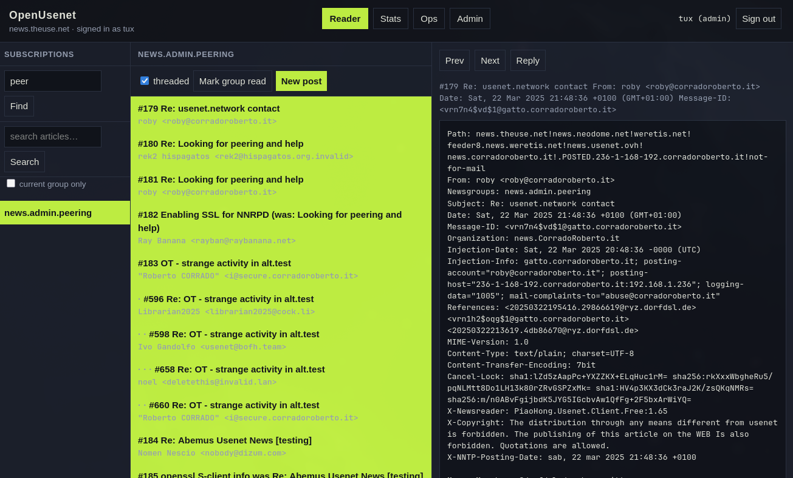
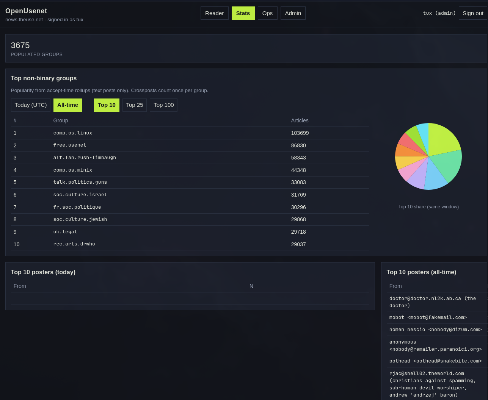
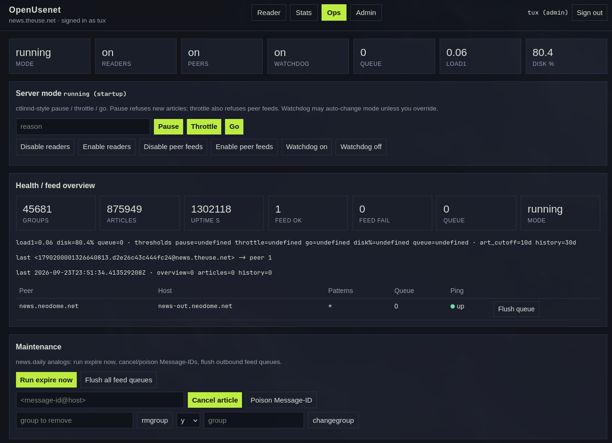
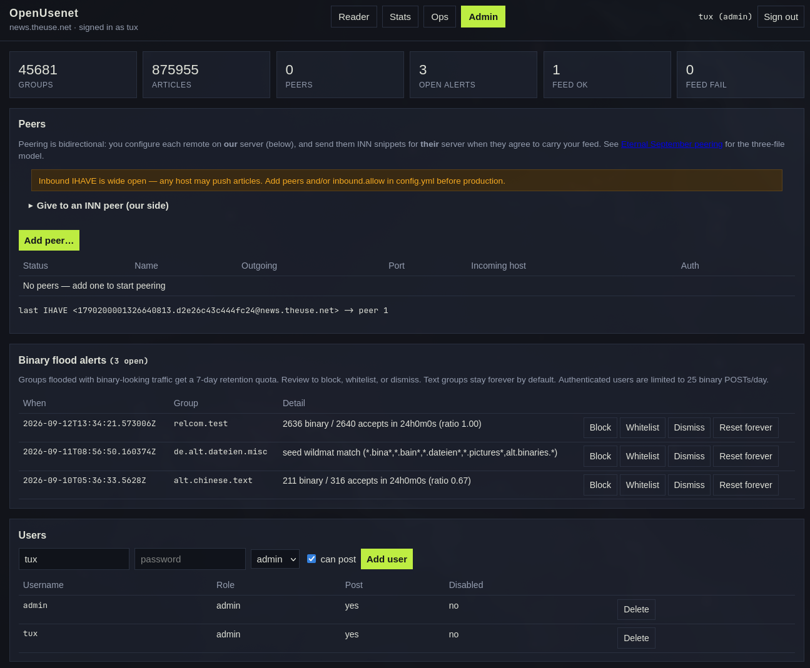
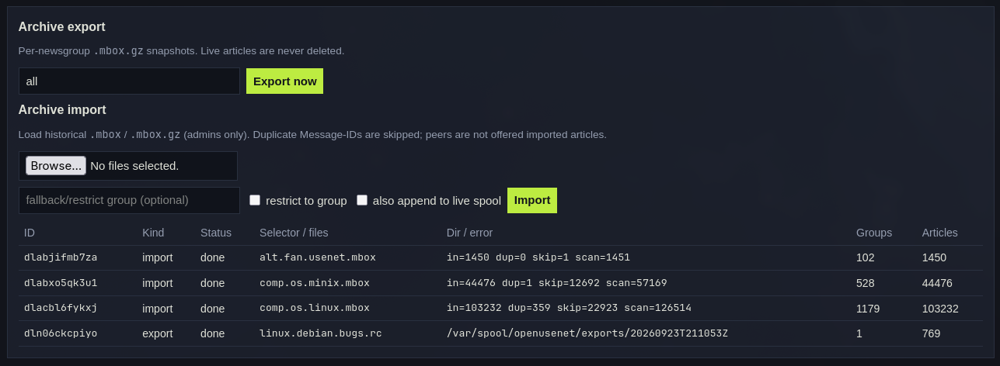

# OpenUsenetServer

**Version 0.5.0**

A modern easy-to-setup NNTP server based on [INN](https://www.eyrie.org/~eagle/software/inn/).

Thanks to Russ Allbery, Julien Élie, and all of the developers of INN!

## Why use OpenUsenetServer?

OpenUsenetServer (OUS) is for people who want to run a real Usenet peer without spending a weekend in the weeds.

- **Compose-first** — `docker compose up` brings up NNTP, PostgreSQL, Cleanfeed, and the web server.
- **One binary, clear config** — hostname, peers, and retention live in YAML or environment variables.
- **Web admin** — newsreader, stats, ops, peer management, usenet full-text search, and INN-compatible peering snippets in the browser.
- **Ready to peer** — Uses INN newsfeeds-style patterns and flags.
- **Spam-aware by default** — cleanfeed-ng ships in the image and can reject junk on ingest.
- **Archives** — Backup newsgroups on-demand, scheduled, and import historical Usenet from the Internet Archive to your newsgroups.
- **Built for hobbyists** — a single VM hobbyist peer is a first-class deployment, not an afterthought.

OUS speaks the same protocols and peering habits the network already uses, so you can join existing peers and grow from there.

## Screenshots

Web portal at a glance (Reader and Stats for every logged-in user; Ops and Admin for admins).

**Reader** — subscriptions, threaded overview, and article view:



**Stats** — populated groups, top non-binary groups (today / all-time), posters, and Path providers:



**Ops** — pause / throttle / go, health and feed queues, expire and cancel:



**Admin** — peers, binary-flood alerts, and users:



**Archive** — export/import `.mbox.gz` and recent jobs (on the Admin page):



## Quick start (Docker Compose)

Pull the published image from Docker Hub — no local Go toolchain required:

```bash
cp .env.example .env
# set OPENUSENET_HOSTNAME, ADMIN_DOMAIN, ACME_EMAIL for a public host
# optional first admin: OPENUSENET_BOOTSTRAP_ADMIN=admin:changeme
docker compose pull
docker compose up -d
printf 'CAPABILITIES\r\nQUIT\r\n' | timeout 3 nc 127.0.0.1 119
# admin (local):  http://127.0.0.1:8080/
# admin (public): https://$ADMIN_DOMAIN/   # Caddy + Let's Encrypt; see docs/tls.md
```

Compose uses `jsevans/openusenet:0.5.0` by default (`OPENUSENET_IMAGE` overrides the tag).

Default seed group: `local.test`, plus the ISC `active` / `newsgroups` files from https://ftp.isc.org/usenet/CONFIG/ (pulled on `openusenet migrate`).

Caddy terminates HTTPS for the admin portal on ports 80/443. Port 8080 is bound to localhost only. NNTPS (563) is not enabled in Compose yet; cleartext NNTP on 119 is what peers use today.

### Build the image yourself

Only needed if you are developing OUS or want an unreleased tree:

```bash
docker build -t jsevans/openusenet:0.5.0 -t jsevans/openusenet:latest .
# or: docker compose build
docker compose up -d
```

## Auth

- Anonymous NNTP **read** is allowed.
- Once any user exists, **POST** requires `AUTHINFO USER` / `AUTHINFO PASS` with `can_post` or `admin`.
- Admin portal requires login. First admin: setup page, `openusenet user add --admin ...`, or `OPENUSENET_BOOTSTRAP_ADMIN=user:pass`.

## Layout

| Path | Role |
|------|------|
| `cmd/openusenet` | CLI |
| `internal/nntp` | RFC 3977 session |
| `internal/store` | PostgreSQL (and in-memory tests) |
| `internal/admin` | Admin portal |
| `pictures/` | Portal screenshots for this README |
| `internal/archive` | Live mbox spool + mbox.gz export/import |
| `docs/backup-and-archive.md` | Backup / IA notes |
| `docs/tls.md` | Caddy / Let's Encrypt admin HTTPS; NNTPS later |
| `config.example.yml` | Local config |
| `docker/Caddyfile` | Reverse proxy for admin HTTPS |

License: BSD 2-Clause.
